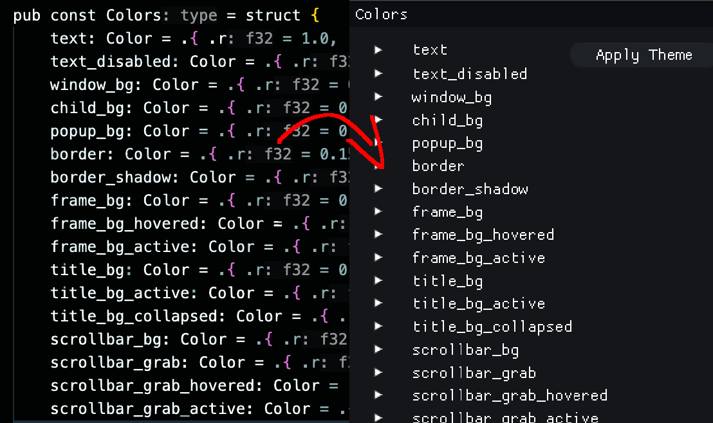

# zfx

Cross-platform GUI and graphics engine for Zig. 

One import for cimgui, sokol-zig, as well as a custom reflection-based widget generator and a constraint-based layout system inspired by Clay.h.

All in ~300 lines of zig code.

# [LIVE DEMO](https://lizard-demon.itch.io/zfx-template)

[**DEMO PROJECT TEMPLATE**](template/)



## What's Included

zfx packages everything you need for cross-platform graphics and UI:

- **[Sokol](https://github.com/floooh/sokol)**: Cross-platform graphics (Metal, D3D11, WebGL2, OpenGL)
- **[Dear ImGui](https://github.com/ocornut/imgui)**: Immediate mode GUI via [cimgui](https://github.com/cimgui/cimgui)
- **UI Reflection**: Auto-generate widgets from any Zig type (inspired by ImReflect)
- **Constraint Layout**: Flexbox-like layout system (inspired by Clay.h)
- **Professional Build System**: One-line setup for native and web

All accessible through a single `@import("zfx")` - no manual dependency wrangling.

## Features

- **Cross-Platform**: Native (Windows, macOS, Linux) and Web (WASM) from the same code
- **Type-Safe**: Compile-time reflection generates UI from your structs
- **Minimal**: Only ~300 lines of code

## Install

```bash
zig fetch --save git+https://github.com/lizard-demon/zfx#<commit-hash>
```

Add to your `build.zig`:

```zig
const std = @import("std");

pub fn build(b: *std.Build) void {
    const target = b.standardTargetOptions(.{});
    const optimize = b.standardOptimizeOption(.{});

    // Get zfx dependency and build helpers
    const zfx_dep = b.dependency("zfx", .{ .target = target, .optimize = optimize });
    const zfx = @import("zfx").zfx;

    // Setup zfx module with graphics (sokol + imgui)
    const zfx_mod = zfx.build.native.gfx(b, target, optimize, zfx_dep);

    // Build your executable
    const exe = b.addExecutable(.{
        .name = "myapp",
        .root_module = b.createModule(.{
            .root_source_file = b.path("src/main.zig"),
            .target = target,
            .optimize = optimize,
            .imports = &.{.{ .name = "zfx", .module = zfx_mod }},
        }),
    });

    // Link and run
    zfx.build.native.link(b, exe);
    const run_cmd = zfx.build.native.run(b, exe);
    if (b.args) |args| run_cmd.addArgs(args);
    b.step("run", "Run the app").dependOn(&run_cmd.step);
}
```

### Web Builds

For web builds, detect the target and use `zfx.build.web.*`:

```zig
if (target.result.cpu.arch.isWasm()) {
    const gfx = zfx.build.web.gfx(b, target, optimize, zfx_dep);
    
    const lib = b.addLibrary(.{
        .name = "myapp",
        .root_module = b.createModule(.{
            .root_source_file = b.path("src/main.zig"),
            .target = target,
            .optimize = optimize,
            .imports = &.{.{ .name = "zfx", .module = gfx.module }},
        }),
    });
    
    const link_step = try zfx.build.web.link(b, lib, target, optimize, gfx.dep_sokol, null);
    b.getInstallStep().dependOn(&link_step.step);
    
    const run_cmd = zfx.build.web.run(b, "myapp", gfx.dep_sokol);
    run_cmd.step.dependOn(&link_step.step);
    b.step("run", "Run the app").dependOn(&run_cmd.step);
}
```

Build for web: `zig build -Dtarget=wasm32-emscripten`

See `demo/build.zig` for a complete independant install which shows off both native and web support.

## Usage

```zig
const zfx = @import("zfx");

var config = struct {
    count: i32 = 42,
    enabled: bool = true,
    scale: f32 = 1.5,
}{};

// Auto-generate UI from any type
_ = zfx.ui.reflect.input("config", &config);
```

## Tips

**Expand structs by default**: Instead of `zfx.ui.reflect.input("config", &config)` which creates a collapsible tree node, iterate the fields directly to show them expanded:

```zig
inline for (comptime std.meta.fields(@TypeOf(config))) |field| {
    const label = field.name ++ "\x00";
    _ = zfx.ui.reflect.input(@ptrCast(label.ptr), &@field(config, field.name));
}
```

This gives you fine-grained control over how structs are displayed.
